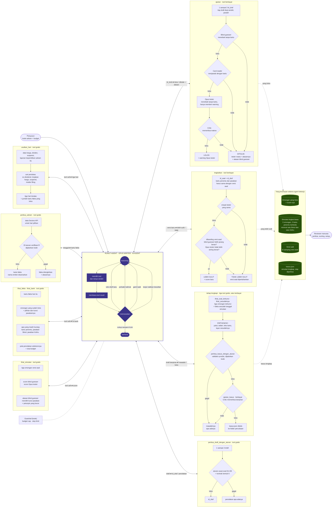

# Runut

Pemula saham dikepung klaim dari grup dan media sosial; Runut adalah latihan singkat memeriksa omongan seperti itu ke dokumen resminya, lewat simulasi dari satu hari bursa nyata yang soalnya disusun AI agent di atas data Sectors.

Situs: <https://alpha.zaa.my.id> · Teaser (1 menit): <https://youtube.com/shorts/WP2YC5b52E4> · Video demo (3 menit): <https://youtu.be/n1AgIi5rYk4>

## Untuk juri: 60 detik

- **Produk.** Pemain membaca kartu fakta satu saham pada satu tanggal, lalu memutuskan tiga omongan teman itu Betul atau Keliru; sesudahnya dibuka apa yang terjadi. Sectors Hackathon 2026, Track 01 (AI Agents & Assistants).
- **Untuk siapa.** Pemain pemula (aplikasi di `web/`) dan penyusun/pengajar yang menyiapkan simulasi (halaman penyusun di `alat/penyusun/`).
- **Di mana Runut Agent bekerja.** `alat/agen/jalan-agen.ts`: satu AI agent dengan 12 tool. Dari kode saham ia memutuskan sendiri hari mana yang dibekukan, topik tiap omongan, isi draft, tool mana dipanggil dan kapan, memperbaiki draft atau ganti topik, dan kapan berhenti.
- **Yang diputuskan kode, bukan AI.** 33 aturan verifikasi atas data Sectors, aturan bentuk soal, urutan empat tester, dan guardrail budget.
- **Bukti nyata.** Simulasi AMAG (15 Juni 2026) di situs seluruhnya ditulis Runut Agent, sama byte per byte dengan keluaran agent di repo; alpha 21 Sep–5 Okt 2026 dibuka 150 orang. Lihat [Hasil](#hasil).
- **Periksa tanpa API key** (sesudah `npm install`): `npm run agen:replay` · `npm run penyusun` · `npm test`.

## Syarat Track 01 → di mana di repo

| Syarat resmi | Di mana | Apa yang ada di sana |
|---|---|---|
| multi-step reasoning flows | `alat/agen/jalan-agen.ts`, `factory/llm/agen/prompt-agen.md` | Loop `ToolLoopAgent`: reasoning → memilih tool → membaca tool result → memutuskan langkah berikutnya, dalam tiga tahap (susun, tingkatkan, lengkapi). |
| custom tool-use pipelines | `factory/llm/agen/alat.ts`, `factory/llm/agen/lengkapi.ts`, `alat/agen/alat-sectors.ts` | 12 tool buatan sendiri; `ajukan` menjalankan blind guesser → card reader → tester → critic untuk tiap draft. |
| memory or state management | `factory/llm/bebas/bank.ts`, `eval/bank-omongan/`, `eval/penyusun/` | Kumpulan omongan yang lolos beserta score-nya, dibaca agent lewat `lihat_bank` dan `lihat_simulasi`; tiap langkah ditulis ke `jejak-agen.jsonl`. |
| autonomous task execution | `alat/agen/jalan-agen.ts` (mode `--kode`), `factory/llm/agen/anggaran.ts` | Masukan hanya kode saham dan budget; agent bekerja sampai simulasi terakit atau ia memutuskan berhenti, di dalam guardrail budget dan step limit. |
| a purpose-built interface for a specific participant and problem | `web/`, `alat/penyusun/halaman/agen.html` | Aplikasi pemain untuk pemula (ponsel, tanpa login) dan tampilan AI agent untuk penyusun: Ringkas, Rinci, Diagram. |
| Sectors data at its core | `alat/sectors.ts`, `factory/verifikasi/`, `docs/bukti/gudang-manifest.json` | Setiap kartu fakta berasal dari Sectors API dan hanya tampil sesudah lolos aturan verifikasi; tanpa Sectors tidak ada simulasi. |

## Runut Agent

AI agent digambar sekali di tengah; kedua belas tool menempel ke agent dengan panah bolak-balik (tool call ⇄ tool result). Tidak ada panah dari satu tool ke tool lain: urutan pemanggilan diputuskan agent, bukan kode. Sumber diagram: [`docs/arsitektur-agen.md`](docs/arsitektur-agen.md).



Tool yang didaftarkan ke agent di `alat/agen/jalan-agen.ts` (12 tool; nama persis seperti di kode):

| Tool | Tahap | Biaya | Guna |
|---|---|---|---|
| `usulkan_hari` | susun (mode `--kode`) | gratis | Hari-hari yang layak dibekukan untuk saham itu: tanggal, jenis peristiwa, alasan, jumlah kartu fakta yang lolos. |
| `periksa_saham` | susun (mode `--kode`) | gratis | Data Sectors untuk tanggal pilihan agent dijalankan lewat 33 aturan verifikasi; kembali kartu fakta yang lolos dan yang disingkirkan. |
| `lihat_fakta` | semua tahap | gratis | Semua kartu fakta hari simulasi. |
| `lihat_bank` | susun | gratis | Omongan yang sudah lolos, kartu penentu yang sudah terpakai, dan sisa budget. |
| `periksa_draft_dengan_aturan` | susun, tingkatkan | gratis | Satu sampai tiga draft diperiksa program terhadap aturan penulisan soal; kembali penolakan apa adanya atau `id_draf`. |
| `ajukan` | susun | berbayar | Satu sampai tiga `id_draf` diuji para tester; yang lolos masuk bank. |
| `lihat_simulasi` | tingkatkan | gratis | Tiga omongan versi asal, score tiap omongan, dan alasan blind guesser memilih kunci jawaban. |
| `tingkatkan` | tingkatkan | berbayar | Versi lebih sulit diuji berdampingan; disimpan hanya bila lolos semua pemeriksaan dan terukur lebih sulit. |
| `lihat_soal_terkunci` | lengkapi | gratis | Tiga omongan yang sudah terkunci beserta `id_omongan`-nya; teks soal tidak bisa diubah. |
| `lihat_sesudahnya` | lengkapi | gratis | Fakta sesudah tanggal simulasi yang lolos aturan verifikasi, untuk bagian "apa yang terjadi sesudahnya". |
| `periksa_kasus_dengan_aturan` | lengkapi | gratis | Draft lampiran dibangun menjadi kasus dan dijalankan lewat validator yang sama dengan produk; kembali masalahnya atau `id_lampiran`. |
| `ajukan_kasus` | lengkapi | berbayar | Satu `id_lampiran` diperiksa satu critic; bila lolos, kasus ditulis ke folder percobaan. |

Tiga tahap itu adalah tiga cara menjalankan agent yang sama: **susun** (tiga omongan dari kode saham), **tingkatkan** (`--tingkatkan`: menaikkan kesulitan simulasi yang sudah terakit), dan **lengkapi** (`--lengkapi`: judul, istilah, teks kartu, dan layar sesudahnya). Guardrail-nya kode: budget cap di `factory/llm/agen/anggaran.ts` menolak panggilan model sebelum terkirim, dan step limit menutup percakapan. Petunjuk yang dibaca agent ada di `factory/llm/agen/prompt-agen.md`, `prompt-tingkatkan.md`, dan `prompt-lengkapi.md`; modelnya model bahasa besar lewat OpenRouter (nama model ada di kode dan `docs/bukti/`).

## Hasil

- Runut Agent menyusun tiga soal yang lolos semua tester untuk enam saham: AGAR, ALII, AMAG, TIRT, BOLT, MLPT, dengan biaya model US$0,60–1,37 per simulasi (biaya nyata dari penyedia) ditambah 5–8 kredit Sectors API per saham. Simulasi MLPT (7 Oktober 2025, US$0,82) disusun dengan menekan tombol di halaman penyusun; jejaknya ada di `eval/penyusun/pn-20261006-061713/`.
- Dari enam itu, satu yang sudah bisa dimainkan: AMAG. Hanya AMAG yang sudah melewati tahap lengkapi, diperiksa reviewer manusia, dan dipasang ke aplikasi. Lima lainnya ada di repo sebagai keluaran agent (`eval/penyusun/`) dan belum dipasang.
- Simulasi AMAG (15 Juni 2026) di situs seluruhnya ditulis Runut Agent mulai dari kode saham: memilih hari, kartu fakta, tiga soal, dan bagian "apa yang terjadi sesudahnya". `cases/amag-2026-06-15.json` sama byte per byte dengan `eval/penyusun/m2d29-amag-lengkapi-3/kasus.json`; sha256 keduanya `f97a0ff2f30660f0500892a974d9b145c94f27e8049275734b0b87f2a9c1ddb0`.
- Alpha 21 Sep–5 Okt 2026: 150 orang membuka; 48 menyelesaikan tiga soal; 44 memberi penilaian, rata-rata 4,0 dari 5.
- 33 aturan verifikasi aktif (kode, bukan AI) menyaring data Sectors sebelum menjadi kartu.
- Jejak kerja agent (tool call, tool result, biaya per langkah) tersimpan di `eval/penyusun/` dan bisa diputar ulang tanpa jaringan.

## Menjalankan

Butuh Node ≥ 22.6.

**(a) Bermain lokal**

```bash
npm install
npm run dev        # pemain di http://localhost:5173
```

Berkas simulasi sudah ikut di `cases/`. `?kasus=<id>` membuka satu simulasi tertentu, misalnya `http://localhost:5173/?kasus=amag-2026-06-15`.

**(b) Halaman penyusun: memutar ulang rekaman, atau menjalankan agent**

```bash
npm run penyusun                                        # http://127.0.0.1:8790/ — dua pilihan di satu halaman (Ringkas, Rinci, Diagram)
npm run agen:replay                                     # di terminal: percobaan AMAG dari kode saham
npm run agen:replay -- --daftar                         # semua percobaan yang punya rekaman
npm run agen:replay -- --id m2d27-amag-naik-2 --cepat   # percobaan lain, tanpa jeda; --penuh menampilkan reasoning utuh
```

Halaman `npm run penyusun` punya dua pilihan, dan namanya mengatakan apa yang terjadi:

- **Putar ulang rekaman** memutar ulang rekaman kerja Runut Agent yang sudah ada di repo (saham AMAG). Tanpa API key, tanpa jaringan, tidak ada model yang dipanggil. `npm run agen:replay` melakukan hal yang sama di terminal. Keduanya hanya membaca `eval/penyusun/<id>/` (`jejak-agen.jsonl` dan `hasil.json`).
- **Jalankan Runut Agent** menjalankan agent sungguhan untuk kode saham yang diketik: program yang sama dengan `npm run agen` di (c), tahap susun. Ini berbayar dan butuh `.env` seperti di (c); tanpa `.env` pilihan ini tampil nonaktif dengan cara mengisinya. Agent baru dinyalakan sesudah budget disetujui di halaman (bawaan US$1,50; dari halaman paling banyak US$2), hanya satu pada satu waktu, dan ada tombol Hentikan. Tiap langkah muncul di halaman begitu agent menulisnya ke `eval/penyusun/<id>/jejak-agen.jsonl`; keluarannya sama dengan (c). Data saham yang belum ada di cache lokal hanya diambil dari Sectors API bila izinnya dicentang.

**(c) Menjalankan agent sungguhan dari terminal dengan kunci sendiri** (berbayar)

```bash
cp .env.example .env    # isi nilainya sendiri; .env tidak pernah di-commit

# tahap susun: dari kode saham, agent memilih harinya sendiri
npm run agen -- --id <id-baru> --kode AMAG --pagu 1.5 --setuju-berbayar --setuju-kredit-sectors

# tahap tingkatkan dan lengkapi, atas simulasi yang sudah terakit
npm run agen -- --id <id-baru> --paket eval/penyusun/<id-susun>/paket.json --tingkatkan --pagu 1.5 --setuju-berbayar
npm run agen -- --id <id-baru> --paket eval/penyusun/<id-susun>/paket.json --lengkapi --pagu 1.5 --setuju-berbayar
```

- Tahap susun juga bisa dijalankan dari halaman di (b), dengan guardrail yang sama; tahap tingkatkan dan lengkapi hanya dari terminal.
- `.env` memuat `SECTORS_API_KEY`, `LLM_BASE_URL` (alamat OpenRouter), `LLM_API_KEY`, `LLM_MODEL`, dan `LLM_PAGU_USD`. Kunci hanya dibaca kode.
- `--id` adalah nama folder baru di `eval/penyusun/`; `--pagu` adalah budget percobaan itu dalam dolar; tanpa `--setuju-berbayar` perintahnya berhenti sebelum memanggil apa pun.
- `--setuju-kredit-sectors` mengizinkan pengambilan data saham yang belum ada di cache lokal dari Sectors API (memakai kredit). Flag lain: `--target 1..3`, `--langkah <n>`, `--bank <folder>`, `--omongan id1,id2,id3` (bersama `--lengkapi`).
- Keluaran: `eval/penyusun/<id>/` — `paket.json`, `jejak-agen.jsonl`, `mentah-agen.jsonl`, `mentah-panggilan.jsonl`, `hasil.json`, dan pada tahap lengkapi `lampiran-agen.json` serta `kasus.json`. Agent tidak pernah menulis ke `cases/`; memasang kasus ke produk adalah keputusan reviewer manusia.

**(d) Tes**

```bash
npm test             # vitest: aturan verifikasi, tool agent, guardrail budget, replay, aplikasi pemain
npm run typecheck
npm run e2e          # memainkan Runut di Chromium, ponsel 360 x 640, terang dan gelap
npm run periksa:desain
```

## Data Sectors dan 33 aturan verifikasi

Semua angka di kartu berasal dari Sectors Financial API v2 (harga harian, dividen, suspensi, laporan kepemilikan, laporan keuangan, aksi korporasi). Sebelum menjadi kartu, data itu melewati aturan verifikasi yang berjalan **tanpa LLM**: 33 aturan aktif (`aturanAktif()` di `factory/verifikasi/v2.ts`), masing-masing dijelaskan dengan contoh nyata di [`docs/aturan-verifikasi.md`](docs/aturan-verifikasi.md). Fakta yang tidak lolos disingkirkan beserta alasannya, dan tidak pernah sampai ke agent sebagai kartu. Agent memanggil aturan yang sama lewat tool `periksa_saham` (`alat/agen/alat-sectors.ts`).

Aturan yang sama berjalan atas seluruh gudang data dengan `npm run verifikasi:gudang`; agregatnya ada di [`docs/bukti/aturan-gudang.md`](docs/bukti/aturan-gudang.md). Hash sha256 tiap berkas data yang dipakai tercatat di `docs/bukti/gudang-manifest.json`.

## Bukan saran investasi

Runut adalah latihan membaca dokumen, bukan nasihat investasi. Data menggambarkan keadaan pada tanggal tertentu di masa lalu dan bukan kondisi perusahaan sekarang. Pemain menjawab pertanyaan tentang membaca data dan hak pemegang saham — bukan menebak harga, bukan memutuskan beli atau jual — dan produk ini tidak pernah menyarankan membeli atau menjual efek apa pun.

## Rincian teknis

### Simulasi mana yang dimainkan

Aplikasi pemain memuat tiga simulasi (`web/src/kasus.ts`). Dua yang pertama disusun bersama manusia sebelum Runut Agent ada; yang ketiga ditulis Runut Agent. Pada kunjungan pertama pemain tidak memilih sendiri:

| simulasi | tanggal beku | pelajarannya |
|---|---|---|
| `dada-2025-10-08` | 8 Oktober 2025 | harga melonjak sementara pemilik besarnya menjual |
| `ultj-2026-05-04` | 4 Mei 2026 | dividen tiap tahun, orang dalam membeli, dan tanggal ex |
| `amag-2026-06-15` | 15 Juni 2026 | harga naik beruntun; hari, kartu, dan soalnya dipilih dan ditulis Runut Agent |

- **Kunjungan pertama:** satu simulasi dipilih acak seragam.
- **Kunjungan berikutnya:** simulasi yang **belum** dimainkan dari browser itu. Daftarnya disimpan di `localStorage` (`kasus_dimainkan`). Kalau semuanya sudah dimainkan, simulasinya acak lagi.
- **Kalender simulasi** di layar terima kasih: hanya simulasi nyata yang tampil, yang sudah selesai diberi centang. Pengunjung yang kembali juga mendapat tautan kecil ke kalender di layar pertama.
- **`?kasus=<id>`** memaksa satu simulasi, untuk juri dan untuk uji. Nilai yang tidak dikenal diabaikan diam-diam, seperti `?k=`.

**Level soal dipilih saat simulasi dipasang, bukan oleh pemain.** Tahap tingkatkan menghasilkan versi lebih sulit dari satu soal dan menyimpannya di samping versi asal; reviewer manusia memutuskan versi mana yang masuk ke `cases/`. Aplikasi pemain belum punya pilihan level.

Label tiap simulasi adalah **peristiwanya**, bukan penilaian atas sahamnya: tidak ada kata "sehat", "bagus", atau "buruk" di teks simulasi mana pun, dan itu dijaga tes.

### Mesin verifikasi

Produk ini menjanjikan satu hal: setiap angka di kartu sudah diperiksa. Yang memeriksanya adalah sekumpulan aturan yang berjalan **tanpa LLM**, ditulis di `docs/aturan-verifikasi.md` dan dijalankan kode di `factory/verifikasi/`. Aturan itu berjalan atas **seluruh** emiten di gudang data, bukan atas satu simulasi:

```bash
npm run verifikasi:gudang
```

Perintah itu menulis hasil lengkapnya ke `.cache/m2b/gudang.json` dan agregatnya ke `docs/bukti/aturan-gudang.md`. Ia tidak membaca jaringan, jam dinding, maupun angka acak, jadi dijalankan dua kali atas data yang sama, hasilnya berkas yang sama persis.

Tiap aturan wajib melaporkan **berapa yang sungguh diperiksa**, bukan hanya berapa yang merah, dan tiap temuan punya berat: `konflik` menolak kartu, `peringatan` menandai yang janggal, `catatan` adalah label. Fakta yang datanya tidak cukup untuk diputuskan berstatus `TIDAK_LENGKAP` — bukan konflik, dan bukan "belum diperiksa".

Sebuah simulasi **diverifikasi dengan dokumen yang sudah terbit pada tanggal bekunya**, bukan dengan seluruh data yang ada hari ini. Alasannya sama dengan alasan simulasi itu ada: yang ditanyakan adalah apa yang bisa dibaca pada hari itu. Yang terjadi sesudah tanggal beku tetap muncul, di layar pembukaan.

Simulasi yang sudah live tidak ikut bergeser ketika gudang atau aturan bertambah: daftar aturan tiap simulasi yang live dibekukan di `docs/bukti/aturan-beku-kasus.json`, dan `npm run build:case` hanya membaca 111 berkas yang hash-nya dibekukan di `docs/bukti/gudang-beku-kasus.json`.

### Mengambil ulang data Sectors

Data mentah Sectors tidak ikut repo, tetapi pengambilnya ikut (`alat/sectors.ts`). Isi `.env` di akar repo dengan kunci API Sectors milik sendiri (`SECTORS_API_KEY=…`); kunci hanya dibaca kode dan hanya dikirim sebagai header `Authorization`.

```bash
npm run sectors:ambil -- "/v2/daily/ULTJ/?start=2026-01-01&end=2026-03-31" ULTJ-contoh.json
npm run sectors:ambil -- --saldo        # kredit terpakai menurut buku kas
npm run sectors:manifest                # sha256 tiap berkas -> docs/bukti/gudang-manifest.json
```

- Biaya tiap panggilan dihitung **sebelum** memanggil, dan panggilan yang akan melewati batas kredit (`SECTORS_KREDIT_PAGU`) tidak dikirim. Buku kasnya `.cache/sectors/kredit.csv`.
- Berkas yang sudah ada di `.cache/sectors/` tidak pernah ditimpa; panggilannya dilewati dengan biaya 0.
- `docs/bukti/gudang-manifest.json` memuat nama, ukuran, sha256, dan path endpoint tiap berkas, sehingga berkas yang diambil ulang bisa dicocokkan byte per byte.

Audit gudang — emiten yang pernah disuspensi dan pembandingnya, dipilih dengan aturan tetap sebelum datanya diambil (`docs/bukti/audit-rencana.md`) — hasilnya ada di [`docs/bukti/audit-gudang.md`](docs/bukti/audit-gudang.md).

### Uji di browser sungguhan

```bash
npm run e2e          # memainkan Runut di Chromium, ponsel 360 x 640, terang dan gelap
npm run e2e:lihat    # sama, tetapi kelihatan
```

`npm run e2e` menyalakan servernya sendiri dan mematikannya lagi, lalu memainkan **tiap simulasi** penuh terhadap **build produksi dengan pengumpul peristiwa yang sungguhan**. Tiap layar disimpan sebagai PNG di `.cache/e2e/layar/<proyek>/`, supaya bisa dilihat tanpa membuka browser.

Ia ada karena tes unit tidak bisa melihat apa yang dilihat pemain: repo ini sengaja tanpa jsdom, dan browser tanpa frame tidak menjalankan `IntersectionObserver`, animasi, maupun gulir.

**Aturan repo: setiap cacat yang ditemukan manusia ditulis dulu sebagai tes e2e yang merah, baru diperbaiki.** Dan setiap tes harus dibuktikan merah dengan merusak kode produk — tes yang tetap hijau ketika kode yang dijaganya rusak bukan penjaga. Tabel "cacat → tes → sabotase" dan cara menambah tes baru ada di [`docs/uji-e2e.md`](docs/uji-e2e.md).

### Apa yang dicatat

Secara baku **tidak ada apa pun yang dikirim ke mana pun.** Aplikasi yang dibangun tanpa `VITE_KOLEKTOR_URL` tidak memuat satu pun alamat untuk dihubungi; itu diperiksa dari isi `web/dist/`, bukan dari membaca kode.

Kalau alamat pengumpul diisi saat build — yang hanya dilakukan untuk uji coba terbatas — kalimat inilah yang dibaca pemain di layar akhir, dan ia dimaksudkan harfiah:

> Kami mencatat apa yang diketuk, seberapa jauh layar digulir, kapan halaman
> ditinggalkan, dan kesalahan teknisnya; juga jenis perangkat dan pengaturan
> tampilan secara garis besar, jam setempat, dan asal tautan — tanpa alamat IP dan
> tanpa identitas. Kami menyimpan satu nomor acak di browsermu supaya tahu kalau
> kamu kembali, dan daftar simulasi yang sudah kamu mainkan. Bukan nama, bukan
> akun; tidak dibagikan ke siapa pun. Teks yang kamu ketik tidak dicatat, kecuali
> kotak masukan ini.

Yang tercatat adalah perilaku di halaman, bukan orangnya:

| dicatat | artinya |
|---|---|
| `mulai` | permainan dibuka: lebar layar, kode penanda tautan, nomor pengunjung, kunjungan ke berapa, dan keterangan **kasar** perangkat dan asal — lihat "Perangkat dan asal" di bawah |
| `layar_masuk` | pindah ke layar mana |
| `kartu_buka` | sumber sebuah lembar dokumen dibuka |
| `pilih` | pilihan jawaban dipindah, dan sudah berapa kali |
| `kunci_jawaban` | jawaban dikunci: pilihannya, benar atau tidak, lama di soal itu, berapa lama lembar-lembarnya terlihat sebelumnya |
| `lihat_balik` | kembali melihat soal yang sudah dikunci |
| `ketuk` | satu ketukan: di layar mana, pada blok bernama apa, di bagian layar sebelah mana (0–1), dan apakah sasarannya memang bisa diketuk |
| `ketuk_dibatasi` | sesi ini menabrak batas 300 ketukan; sesudahnya ketukan tidak dicatat lagi |
| `gulir` | sejauh mana layar itu digulir (0–1): saat meninggalkan layar, **dan** saat 25 %, 50 %, 75 %, lalu 100 % pertama kali terlewat di layar itu |
| `balon` | balon chat melayang diturunkan utuh atau dikembalikan mengintip, dan dengan cara apa: ketukan atau tarikan jari |
| `pembukaan_masuk`, `pembukaan_selesai`, `loncat_ke_ringkasan` | sampai ke layar pembukaan, lama membacanya, seberapa jauh menggulir |
| `minat_kasus_lain` | tombol "Coba simulasi lain" ditekan |
| `akhir_kirim` | isian tiga pertanyaan dan kotak teks di layar akhir |
| `tampak` | halaman tersembunyi (pindah aplikasi, kunci layar) atau terlihat lagi, di layar mana, dan berapa lama tersembunyi; paling banyak 30 per sesi |
| `galat` | kesalahan JavaScript: jenisnya, pesannya **yang sudah disamarkan** (alamat → `‹url›`, angka ≥ 6 digit → `‹n›`, potongan UA → `‹ua›`, dipangkas 120 huruf), dan apakah asalnya aplikasi atau luar; paling banyak 5 per sesi, pesan yang sama sekali saja |
| `kinerja` | sekali per sesi: milidetik sampai layar pertama dirender, dan sampai ketukan hidup pertama (atau kosong bila tidak ada) |
| `tutup` | tab ditutup, di layar mana |

Daftar peristiwa di atas tertutup: pengumpul menolak apa pun di luarnya.

#### Perangkat dan asal

Peristiwa `mulai` membawa lima belas keterangan **kasar**, semuanya kategori atau angka berentang:

| field | isi |
|---|---|
| `os` | `android`, `ios`, `windows`, `mac`, `linux`, `lain` |
| `peramban_dalam` | kategori in-app WebView, `lain` (WebView tanpa nama), atau `tidak` (browser biasa) |
| `perujuk` | kategori asal kunjungan, `langsung`, atau `lain` — dari **nama host** saja |
| `skema_warna`, `penunjuk`, `koneksi`, `bahasa` | `terang`/`gelap` · `kasar`/`halus`/`tidak` · `4g`/`3g`/`2g`/`lambat`/`tidak-tahu` · `id`/`en`/`lain` |
| `jam_lokal`, `hari_lokal`, `zona_menit` | jam 0–23, hari 0–6, zona dalam menit ke timur (WIB = 420) |
| `tinggi_layar`, `rasio_piksel` | tinggi jendela, rasio piksel satu desimal |
| `hemat_data`, `gerak_dikurangi`, `mandiri` | ya/tidak; `null` bila browsernya tidak mengatakan |

User-Agent dibaca **hanya di browser**, oleh fungsi murni `web/src/perangkat.ts`, dan yang keluar hanya dua kategorinya. Alamat referrer tidak pernah disimpan — path dan query-nya dibuang sebelum apa pun dikirim. Tidak ada lebar/tinggi layar fisik, daftar font, canvas, atau fingerprint lain: yang ditanyakan adalah pertanyaan desain ("apakah opsi pertama terlihat tanpa menggulir di ponsel ini"), bukan "siapa orang ini".

#### Ketukan: nama, bukan isi

Yang dicatat sebuah `ketuk` adalah `uid` — nama yang **kami** tulis sendiri di markup, misalnya `opsi:b`, `istilah`, `bilah:turun` — dan bukan isi elemennya. Tidak ada `textContent`, tidak ada nilai kotak teks, tidak ada koordinat mutlak: posisinya relatif terhadap ukuran jendela, dengan tiga desimal. Ketukan yang sebenarnya bagian dari guliran (jari bergerak lebih dari 10 piksel) tidak dicatat sama sekali.

#### Nomor pengunjung

Supaya "seratus peserta" berarti seratus orang dan bukan seratus sesi, aplikasi menyimpan **satu** angka acak (UUID v4) di `localStorage` browser pemain:

| kunci | isi |
|---|---|
| `pengunjung` | satu UUID v4 acak, dibuat di browser pemain, tidak pernah dipakai di tempat lain |
| `kunjungan_ke` | sudah berapa kali halaman ini dibuka dari browser itu |
| `kasus_dimainkan` | daftar `kasus_id` yang sudah dimainkan dari browser itu, supaya kunjungan berikutnya mendapat simulasi lain |
| `simulasi_selesai` | daftar `kasus_id` yang sudah diselesaikan dari browser itu, untuk tanda centang di kalender simulasi |

Isinya nama simulasi, bukan jawaban — jawaban tidak pernah disimpan di browser pemain. Ia **bukan cookie**: tidak ikut terkirim di setiap permintaan dan tidak bisa dibaca situs lain. Kalau `localStorage` tidak tersedia, nomornya `null`, permainan tetap jalan, dan sesi itu dihitung terpisah di ringkasan. Menghapus data situs di browser menghapus nomor itu; kami tidak punya cara mengenalinya lagi, dan memang tidak mau punya.

#### Kode penanda tautan

Tautan yang disebar boleh membawa `?k=<kode>` — huruf kecil dan angka, paling panjang delapan karakter — supaya sesi dari satu saluran bisa dipisahkan dari sesi saluran lain. Kodenya masuk ke peristiwa `mulai` sebagai `penanda`, **tidak pernah tampil di layar**, dan tidak pernah dipakai sebagai identitas. Nilai yang tidak cocok diabaikan diam-diam.

#### Yang tidak ada, dan tidak akan ditambahkan

- tidak ada akun, login, atau nama;
- tidak ada identitas selain satu nomor acak di atas — tidak ada device fingerprint, tidak ada iklan, tidak ada pihak ketiga;
- pengumpul **tidak menulis alamat IP maupun User-Agent** ke berkas — tidak ada header apa pun yang disimpan, dan ia hanya mendengarkan di loopback;
- id sesi adalah angka acak yang hidup di memori tab saja dan hilang saat tab ditutup;
- teks yang diketik tidak pernah dicatat, kecuali kotak masukan di layar akhir yang memang meminta tulisan.

#### Membaca hasilnya

```bash
npm run alpha:ringkas -- alat/contoh/peristiwa-bertingkat.jsonl          # contoh yang ikut repo
npm run alpha:ringkas -- data/*.jsonl --kecuali uji                      # ganti daftar penanda yang dikecualikan
npm run alpha:ringkas -- data/*.jsonl --kecuali-pengunjung daftar.txt    # kecualikan nomor pengunjung sendiri
```

Keluarannya tabel Markdown: berapa orang (bukan berapa sesi), corong per penanda, ketukan teratas per layar, kedalaman gulir, waktu ke ketukan pertama, perangkat, asal, jam setempat, dan kinerja. Jumlah sesi yang dikecualikan selalu ikut dicetak. Contoh berkas peristiwa ada di [`alat/contoh/`](alat/contoh/).

### Riwayat: mesin penyusun sebelum Runut Agent

Sebelum Runut Agent, `factory/llm/` memuat beberapa generasi penyusun yang urutan langkahnya ditetapkan kode: penulis di bawah validator, loop tulis–uji–tulis ulang, loop dengan critic terpisah, penulis bertemplat, dan penulis bebas yang menyimpan omongan lolos. Tester, aturan bentuk soal, guardrail budget, dan simpanan omongan lolos yang dipakai Runut Agent sekarang lahir dari sana. Laporan tiap generasi ada di [`docs/bukti/`](docs/bukti/) (`lingkar-agen*.md`, `uji-tanding-model.md`, `pintu-penyusun.md`), dan halaman penyusun generasi itu masih bisa dibuka dengan `npm run penyusun -- --mesin-lama`.

### Susunan

| Folder | Isi |
|---|---|
| `alat/agen/` | Program yang menjalankan Runut Agent (`jalan-agen.ts`), tool data Sectors, dan replay di terminal |
| `factory/llm/agen/` | Tool agent, guardrail budget, tahap lengkapi, dan prompt |
| `factory/verifikasi/` | Aturan verifikasi data Sectors (kode, tanpa LLM) |
| `factory/` | Selebihnya: pembangun kasus, skema, pemuat data, dan mesin penyusun generasi sebelumnya |
| `cases/` | Simulasi yang live beserta jejak verifikasinya (JSON, ikut di-commit) |
| `eval/penyusun/` | Rekaman tiap percobaan agent: jejak, panggilan mentah, hasil |
| `eval/bank-omongan/` | Kumpulan omongan yang lolos semua tester |
| `web/` | Aplikasi pemain: statis, tanpa login, membaca `cases/` |
| `alat/penyusun/` | Halaman penyusun lokal: menjalankan agent dan memutar ulang rekamannya |
| `server/` | Pengumpul peristiwa alpha: Node bawaan saja |
| `alat/` | Perkakas lain: pengambil Sectors, ringkasan data alpha, gate `periksa:desain` |
| `deploy/` | Berkas dan skrip untuk deploy alpha; tidak pernah dijalankan otomatis |
| `e2e/` | Tes end-to-end di Chromium sungguhan; lihat `docs/uji-e2e.md` |
| `docs/` | Arsitektur agent, aturan verifikasi, isi tiap simulasi, dan bukti |

### Sumber data

- Sectors Financial API v2 (sumber inti; tanpa Sectors tidak ada simulasi)
- Dokumen resmi IDX dan KSEI sebagai pemutus ketika data berkonflik

## Lisensi

MIT — lihat [LICENSE](LICENSE).
