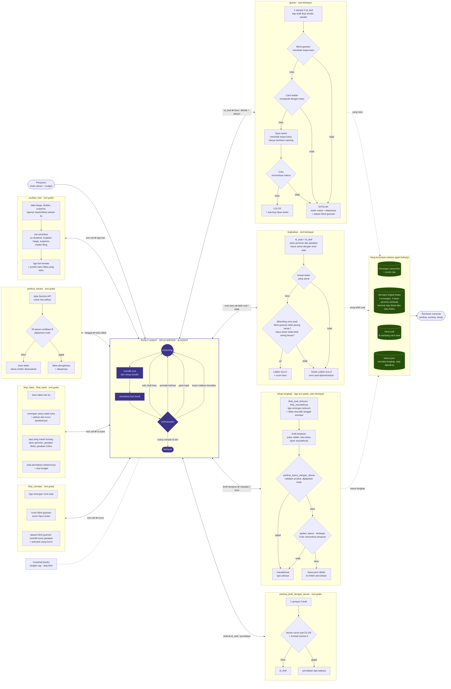

# Arsitektur AI agent Runut

Diagram ini disetujui pemilik pada 5 Okt 2026 untuk dipakai di README. AI agent digambar sekali di tengah; tiap tool menempel ke agent dengan panah bolak-balik (tool call ⇄ tool result). Tidak ada panah dari satu tool ke tool lain: urutan pemanggilan diputuskan agent, bukan kode.

## Istilah di diagram

| Istilah | Arti |
|---|---|
| AI agent | Model (Opus) yang memilih sendiri tool mana yang dipanggil, kapan, dan berapa kali |
| Tool call ⇄ tool result | Agent memanggil tool; tool mengembalikan hasilnya ke agent |
| Blind guesser | Model murah yang menebak jawaban TANPA melihat kartu. Makin jarang ia benar, makin sulit soalnya |
| Card reader | Model yang menjawab DENGAN kartu. Ia harus benar; kalau tidak, soalnya kabur |
| Opus tester | Opus yang menebak tanpa kartu. Hanya memberi warning |
| Critic | Model yang memeriksa makna soal dan penjelasannya |
| Score | Berapa kali tester menebak benar tanpa kartu (mis. 3 dari 12) |
| Guardrail | Batas yang dijaga kode: budget cap dan step limit |

Yang diputuskan agent: hari, topik tiap omongan, isi draft, tool mana dan kapan, memperbaiki atau ganti topik, omongan mana yang dinaikkan kesulitannya, kapan berhenti. Yang diputuskan kode: 33 aturan R, aturan bentuk, urutan empat tester di dalam `ajukan` dan `tingkatkan`, dan budget.
